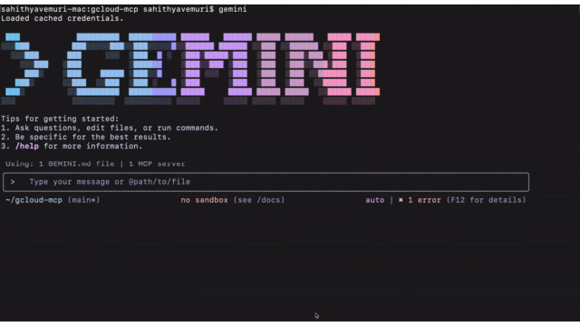
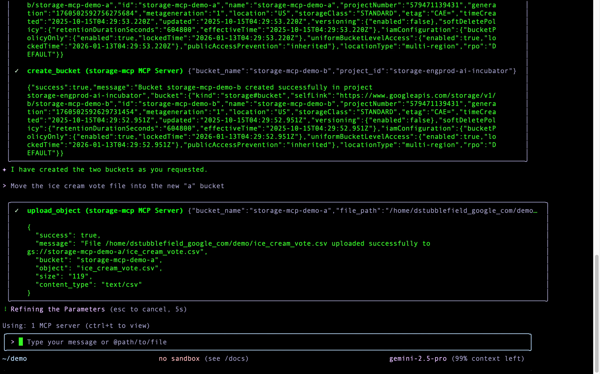
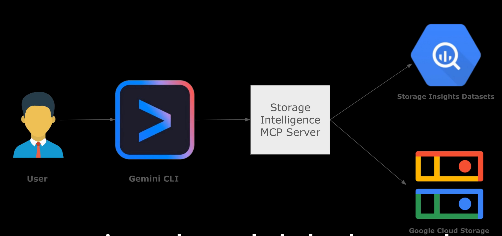

# Storage MCP Server ☁️

The Storage
[Model Context Protocol (MCP)](https://modelcontextprotocol.io/docs/getting-started/intro)
server enables AI assistants to easily interact with Google Cloud Storage for
bucket and object management. With the Storage MCP server you can:

- **Interact with Google Cloud Storage using natural language.** Describe the
  outcome you want instead of memorizing complex command syntax, flags, and
  arguments.

  

- **Automate and simplify complex workflows.** Chain multiple storage operations
  into a single, repeatable command to reduce manual effort and the chance of
  error.

  

- **Lower the barrier to entry for cloud storage management.** Empower team
  members who are less familiar with GCS to perform powerful actions confidently
  and safely.

  

- **Perform analytical and aggregation queries on your objects and buckets.** Perform
  aggregations and compute statistics on entire storage inventory using [Storage Insights
  Datasets](https://cloud.google.com/storage/docs/insights/datasets)

  

- **Run advanced filters and searches on your data.** Search and filter your objects
  by file type, size and other metadata fields using [Storage Insights
  Datasets](https://cloud.google.com/storage/docs/insights/datasets)

  

## 🚀 Getting Started

### Prerequisites

- [Node.js](https://docs.npmjs.com/downloading-and-installing-node-js-and-npm):
  version 20 or higher
- [gcloud CLI](https://cloud.google.com/sdk/docs/install) (for authentication)

## ✨ Set up your MCP server

### Gemini CLI and Gemini Code Assist

To integrate the Storage MCP server with Gemini CLI or Gemini Code Assist, run the
setup command below. This will install the MCP server as a
[Gemini CLI extension](https://github.com/google-gemini/gemini-cli/blob/main/docs/extension.md)
for the current user, making it available for all your projects.

```shell
npx @google-cloud/storage-mcp init --agent=gemini-cli
```

After the initialization process, you can verify that the storage-mcp server is
configured correctly by running the following command:

```
gemini mcp list

> ✓ gcs: npx -y @google-cloud/storage-mcp (stdio) - Connected
```

By default, the server only enables safe, non-destructive tools. To enable
tools that can modify or delete existing data, use the
`--enable-destructive-tools` flag:

```shell
npx @google-cloud/storage-mcp init --agent=gemini-cli --enable-destructive-tools
```

### For other AI clients

To use the Storage MCP server with other clients, add the following snippet to their
respective JSON configuration files:

```json
"gcs": {
  "command": "npx",
  "args": ["-y", "@google-cloud/storage-mcp"]
}
```

Instructions for popular tools:

- **Claude Desktop:** Open **Claude > Settings > Developer > Edit Config** and
  edit `claude_desktop_config.json`.
- **Cline:** Click the MCP Servers icon, then **Configure MCP Servers** to edit
  `cline_mcp_settings.json`.
- **Cursor:** Edit `.cursor/mcp.json` for a single project or
  `~/.cursor/mcp.json` for all projects.
- **Gemini CLI (Manual Setup):**
  [If not using extensions](#gemini-cli-and-gemini-code-assist), edit
  `.gemini/settings.json` for a single project or `~/.gemini/settings.json` for
  all projects.

For **Visual Studio Code** edit the `.vscode/mcp.json` file in your workspace
for a single project or your global user settings file for all projects:

```json
"servers": {
  "gcs": {
    "command": "npx",
    "args": ["-y", "@google-cloud/storage-mcp"]
  }
}
```

## 🛠 Local Development

For more information regarding installing the repository locally, please see
[development.md](doc/DEVELOPMENT.md)

### Testing

To run the integration or E2E tests, you will need to set the
`GOOGLE_CLOUD_PROJECT` or `GCP_PROJECT_ID` environment variable to a valid
Google Cloud project ID.

```shell
export GOOGLE_CLOUD_PROJECT=your-gcp-project-id
npm run test:integration --workspace=packages/storage-mcp
npm run test:e2e --workspace=packages/storage-mcp
```

## 🧰 Available MCP Tools

The Storage MCP server offers two sets of tools: **Safe Tools** and
**Destructive Tools**. By default, only the safe tools are enabled to prevent
accidental data loss.

### Safe Tools

Safe tools are read-only or only create new objects without affecting existing
ones. They will never modify or delete existing data in GCS.

| Tool                        | Description                                                                                                                 |
| :-------------------------- | :-------------------------------------------------------------------------------------------------------------------------- |
| `list_buckets`              | Lists all buckets in a project.                                                                                             |
| `get_bucket_metadata`       | Gets comprehensive metadata for a specific bucket.                                                                          |
| `get_bucket_location`       | Gets the location of a bucket.                                                                                              |
| `view_iam_policy`           | Views the IAM policy for a bucket.                                                                                          |
| `check_iam_permissions`     | Tests IAM permissions for a bucket.                                                                                         |
| `create_bucket`             | Creates a new bucket. Fails if the bucket already exists.                                                                   |
| `list_objects`              | Lists objects in a GCS bucket.                                                                                              |
| `read_object_metadata`      | Reads comprehensive metadata for a specific object.                                                                         |
| `read_object_content`       | Reads the content of a specific object.                                                                                     |
| `download_object`           | Downloads an object from GCS to a local file.                                                                               |
| `write_object_new`          | Writes a new object. Fails if the object already exists.                                                                    |
| `upload_object_new`         | Uploads a file to a new object. Fails if the object already exists.                                                         |
| `copy_object_new`           | Copies an object to a new destination. Fails if the destination already exists.                                             |
| `get_metadata_table_schema` | Checks if GCS insights service is enabled and returns the BigQuery table schema for a given insights dataset configuration. |
| `execute_insights_query`    | Executes a BigQuery SQL query against an insights dataset and returns the result.                                           |
| `list_insights_configs`     | Lists the names of all Storage Insights dataset configurations for a given project.                                         |

### Destructive Tools

**Warning:** These tools can permanently modify or delete existing data. Enable
them only when you are confident that the agent should be allowed to perform
these actions.

You can enable them by running the `init` command with the
`--enable-destructive-tools` flag. When enabled, these tools replace their safe
counterparts (e.g., `write_object` is registered instead of `write_object_new`).

| Tool                     | Description                                                |
| :----------------------- | :--------------------------------------------------------- |
| `delete_bucket`          | **Deletes** a bucket.                                      |
| `update_bucket_labels`   | **Modifies** labels for a bucket.                          |
| `delete_object`          | **Deletes** a specific object from a bucket.               |
| `update_object_metadata` | **Modifies** the custom metadata of an existing object.    |
| `move_object`            | **Moves** an object (copies then deletes the original).    |
| `write_object`           | Writes an object, **overwriting** it if it already exists. |
| `upload_object`          | Uploads a file, **overwriting** the destination object.    |
| `copy_object`            | Copies an object, **overwriting** the destination object.  |

## 🔑 MCP Permissions

The permissions of the Storage MCP are directly tied to the permissions of the
authenticated user or service account. To restrict permissions and operate with
the principle of least privilege, you can
[authorize gcloud as a service account](https://cloud.google.com/sdk/docs/authorizing#service-account)
and assign the service account a
[role with limited permissions](https://cloud.google.com/iam/docs/roles-overview)
for Google Cloud Storage.

## 👥 Contributing

We welcome contributions! Whether you're fixing bugs, sharing feedback, or
improving documentation, your contributions are welcome. Please read our
[Contributing Guide](CONTRIBUTING.md) to get started.

## 🎬 Demos

<p align="center"><b>Click to watch the Storage MCP demo</b><br/>
<a href="./assets/storage_mcp_demo.mp4" title="Click to play demo">

</a>
</p>

<p align="center"><b>Click to watch the Storage MCP demo powered by Storage Insights</b><br/>
<a href="./assets/storage_insights_demo.mp4" title="Click to play demo">

</a>
</p>

## 📄 Important Notes

This repository is currently in preview and may see breaking changes. This
repository is providing a solution, not an officially supported Google product.
It may break when the MCP specification, other SDKs, or when other solutions
and products change. See also our [Security Policy](SECURITY.md).
